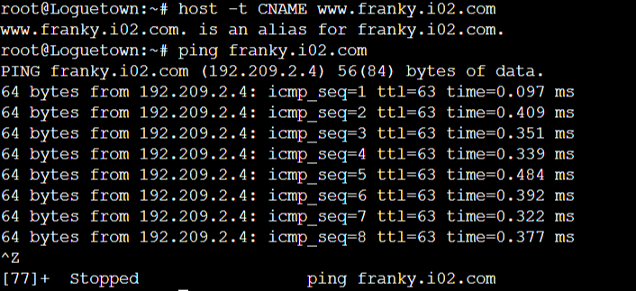

# Jarkom-Modul-2-I02-2021

Made by:

Abyan Ahmad (05111942000013)

Gede Yoga Arisudana (05111942000009)

Zulfiqar Rahman Aji (05111942000019)

The Prefix IP of our group **192.209**.

## Problem 1 
The first thing to do is to paste this command in Foosha node terminal. 

```
iptables -t nat -A POSTROUTING -o eth0 -j MASQUERADE -s 192.209.0.0/16
```
 
 After that, change the IP of each client node in the /etc/resolv.conf to the IP of Enieslobby, Water7, and Skypie. And the IP of Enieslobby, Water7, and Skypie in the /etc/resolv.conf is the IP of Foosha. Command `ping google.com` in each client node to check wheter or not every node has internet connection. 
 
 
 
 
 
<br> 
 
## Problem 2 
In order to make new DNS, configure named.conf.local with the domain name of **franky.i02.com**. We need to add this command to _named.conf.local_. 
 
``` 
zone "franky.i02.com" { 
    type master; 
    file "/etc/bind/kaizoku/franky.i02.com"; 
}; 
```
 
 
 
After that copy db.local in /etc/bind/ and place it in kaizoku folder with the addition from the picture below. 
 
 
 
Command `host -t CNAME [domain.name]` can be used to check the alias of the domain name and `ping [domain.name]` to check the IP of the domain name. 
 
 
 
<br> 
 
## Problem 3 
This problem asks to make another domain name namely **super.franky.i02.com** from Enieslobby pointing to Skypie. It just need to input the IP of the Skypie inside the config in Enieslobby. We need to add this command in _named.conf.local_. 
 
``` 
zone "super.franky.i02.com" { 
    type master; 
    file "/etc/bind/kaizoku/super.franky.i02.com"; 
}; 
``` 
 
 
 
 
And also add another config file inside kaizoku folder just like the problem before. 
 
 
 
The IP below the domain name is the IP of Skypie in order for the DNS to point to Skypie. 
 
 
 
<br> 
 
## Problem 4 
Reverse domain of main domain is just reversing the IP of the main domain. In this case is `192.209.2.2` to `2.209.192`. The 2 will be in the config later. The flow is like making domain name in other problems. First, add a new zone in _named.conf.local_. The name of the zone will be `2.209.192.in-addr.arpa`. 
 
``` 
zone "2.209.192.in-addr.arpa" { 
        type master; 
        file "/etc/bind/kaizoku/2.209.192.in-addr.arpa"; 
}; 
``` 
 
 
 
After that, make a new config in kaizoku folder with the format like other problems with some changes. 
 
 
 
The 2 is the pointer of the reversed IP address. So, in order to check whether or not it is already correct, command `host -t PTR 192.209.2.2` can be used because it is pointer. 
 
 
 
<br> 
 
## Problem 5 
In order to make Water7 as DNS Slave, this command should be added in Water7's _named.conf.local_. 
 
``` 
zone "franky.i02.com" { 
    type slave; 
    masters { 192.209.2.2; }; 
    file "/var/lib/bind/franky.i02.com"; 
}; 
``` 
 
 
 
And also in Enieslobby, we need to add this command. 
 
``` 
zone "franky.i02.com" { 
        type master; 
        notify yes; 
        also-notify { 192.209.2.3; }; 
        allow-transfer { 192.209.2.3; }; 
        file "/etc/bind/kaizoku/franky.i02.com"; 
}; 
```

 
 
 
 
<br>

## Problem 6
First we need to change _named.conf.options_ in both Water7 and Enieslobby configurations.

```
// dnssec-validation auto;

allow-query{any;};
```


In Enieslobby, we need to add a line to make a subdomain for mecha in _/kaizoku/franky.i02.com_.

```
mecha   IN      A       192.209.2.3     ; IP Water7
```


In Water7, we need to make a new folder in _/etc/bind/_ folder namely _sunnygo_ and also inside _sunnygo_ a file namely **mecha.franky.i02.com** with similar content as previous problems.


<br>

## Problem 7
In Water7, we need to make a file in _sunnygo_ folder namely **general.mecha.franky.i02.com**


<br>

## Problem 8
In Skypie, we need to copy a config file and paste it to its directory with this command with **franky.i02.com.conf** name.

```shell
cp /etc/apache2/sites-available/000-default.conf /etc/apache2/sites-available/franky.i02.com.conf
```

We need to add this command inside _franky.i02.com.conf_ file.

```
ServerName franky.i02.com
ServerAlias www.franky.i02.com
ServerAdmin webmaster@localhost
DocumentRoot /var/www/franky.i02.com/
```


After that, we need to make directory named **franky.i02.com** inside _/var/www/_ and then run these commands.

```
a2ensite franky.i02.com
service bind9 restart
```

We can check it using one of the client with `lynx franky.i02.com`.


<br>

## Problem 9
In order to do this problem, we need to make an alias in _franky.i02.com.conf_.

```
Alias "/home" "/var/www/franky.i02.com/index.php/home"
```


<br>

## Problem 10
This problem asks us to make another subdomain named **super.franky.i02.com** with similar config like previous problem. The difference is only like this

```
ServerName super.franky.i02.com
ServerAlias www.super.franky.i02.com
ServerAdmin webmaster@localhost
DocumentRoot /var/www/super.franky.i02.com/
```


We also need to make a new folder in _var/www/_ named **super.franky.i02.com**. And we need to run these commands

```
a2ensite super.franky.i02.com
service apache2 restart
```

We can check it using one of the client with `lynx super.franky.i02.com`.


<br>

## Problem 11
Directory listing can be solved using these commands.

```
<Directory /var/www/super.franky.i02.com/public>
        Options +Indexes
</Directory>
```

We can check it using one of the client with `lynx super.franky.i02.com`.


<br>

## Problem 12
Changing error page can be done using this command.

```
ErrorDocument 404 /error/404.html
```

We can check it using one of the client with `lynx super.franky.i02.com/[randomstring]`.


<br>

## Problem 13
This problem can be solved using these commands.

```
<Directory /var/www/super.franky.i02.com/public/js>
        Options +Indexes
</Directory>

Alias "/js" "/var/www/super.franky.i02.com/public/js"
```

We can check it using one of the client with `lynx super.franky.i02.com/js`.


<br>

## Problem 14
This problem asks us to make another subdomain named **general.mecha.franky.i02.com** with similar config like previous problem but can only be accessed with 15000 port and 15500 port. The config will be like this

```
<VirtualHost *:15000 *:15500>
    ServerName general.mecha.franky.i02.com
    ServerAlias www.general.mecha.franky.i02.com
    ServerAdmin webmaster@localhost
    DocumentRoot /var/www/general.mecha.franky.i02.com/
</VirtualHost>
```
We also need to change _/etc/apache2/ports.conf_ and add these to it.

```
Listen 15000
Listen 15500
```
After that, we need to run these commands in terminal.

```
a2ensite general.mecha.franky.i02.com
service apache2 restart
```
We can check it using one of the client with `lynx www.general.mecha.franky.i02.com:15000`.


<br>

## Problem 15
In order to make authentication, we can add these commands in **general.mecha.franky.i02.com.conf**.

```
<Directory /var/www/general.mecha.franky.i02.com>
        AuthType Basic
        AuthName "Private"
        AuthBasicProvider file
        AuthUserFile "/etc/apache2/.htpasswd"
        Require valid-user
        Options +Indexes
        AllowOverride All
</Directory>
```
Username and password can be added using this command in terminal.


After using this command `lynx www.general.mecha.franky.i02.com:15000`, it will ask for username and password.


After input password, it will show the page like the previous problem.

<br>

## Problem 16
If we input IP of Skypie, it will direct the page to apache index.html page. It implies that it uses _000-default.conf_ to open up the page. So, we can change the DocumentRoot in _000-default.conf_ to **franky.i02.com**.

```
ServerAdmin webmaster@localhost
DocumentRoot /var/www/franky.i02.com
```

<br>

## Problem 17
In order to solve this problem, we need to add some lines of code and .htaccess in the DocumentRoot. The lines of code is added in _/etc/apache2/sites-available/super.franky.i02.com.conf_.

```
<Directory /var/www/super.franky.i02.com>
        Options +Indexes +FollowSymLinks -MultiViews
        AllowOverride All
</Directory>
```

For the .htaccess, we can make regular expression to find the substring of _franky_. The regular expression in the .htaccess can be like this.

```
RewriteEngine On
RewriteRule /public/images/(.*)franky(.*)\.(jpg|png)$ http://super.franky.i02.com/public/images/franky.png [L]
```
The first parameter of RewriteRule is the regular expression which the extension of the file is specified as jpg or png. The second parameter is the location of franky.png in the webpage. The flag L indicates that franky.png is the last destination. After writing this .htaccess, we need to run these commands.

```
a2enmod rewrite
service apache2 restart
```

We can check it using one of the client with `lynx super.franky.i02.com/public/images`.


